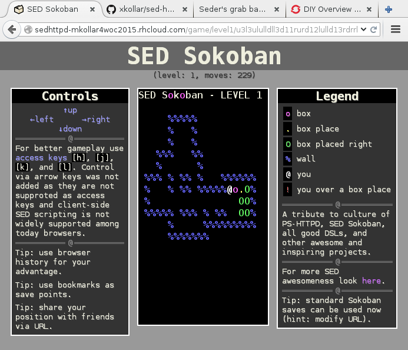

SED-HTTPD
=========

Unleash the power of [GNU sed](https://www.gnu.org/software/sed/)
and let it run your web server!

[SedSocoban](http://aurelio.net/projects/sedsokoban/) included
for awesomeness points!

